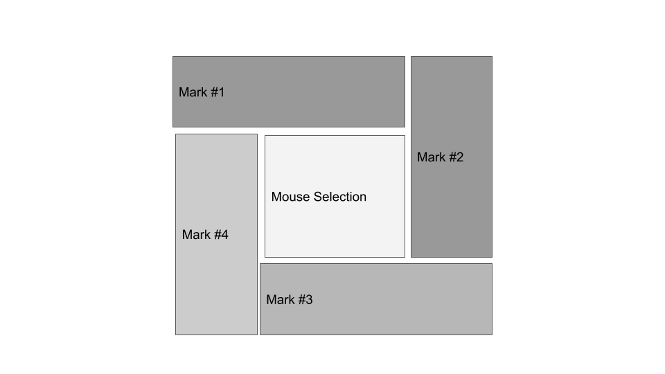

# Problem Statement
Given a web-based application that can "redact" rectangles overlaying a document, 
implement an "un-redaction" feature that can instead redact the areas outside of the
selection.

# Algorithm
Given an array of non-overlapping redaction marks (marks), initiatlized to the whole page, 
use the mouse to sweep out rectangular areas of the page.  For each such selection,
find any marks that are entirely within it and delete them (so that their screen area
shows through as un-redacted.

Make sure to do nothing to any marks that are completely outside of the selection 
(their intersection doesn't exist).

But for any marks in our array, since marks cannot be overlapping, delete the marks that have
an intersection with the selection and "re-tile" them.

The normal case is that the selection is completely within an exiting mark.  In this case, we'll
create 4 new marks and arrange them around the selection like a camara iris.  That is:

An alternate approach, which may make sense when un-redacting text in a document, is to arrange
the new marks such that there is one above and below the selection (think previous and next paragraphs) with two more as the margins.

# Test Harness
I'm looking for a minimal test harness to demostrate the algorithm on a single page.
I found code for making selections on a canvas with a mouse.
The mouse down event starts the selection, mouse movement modifies the current selection, 
and mouse up finishes it. 

I then added rubber-banding of the current selection while the mouse is down.
Each of the new marks is drawn (in the order they were created) with a different, 
descendng shade of gray.
In a prouction environment, they would all be drawn black.  The selections should always have
a white background.

In order to show existing redactions without having the code for drawing and clearing the
current selection rectable overwriting the marks, I added another overapping layer.
And once I had layers, adding a background layer with a "Lorem ipsum" document gives the
tester a place to practice.  At this point, I added transparency for the mark rectangles.

# Testing
The test is some minimal HTML and CSS, and loads a single Javascript file: test.html.
Putting both files in the same directory and then loading test.hml into a web browser with 
file:///*path to*/test.html is enough to start the test.  In my case, the *path_to* value is 
"Users/dj/ACCUSOFT".

For now, reload the page to clear and start again.

